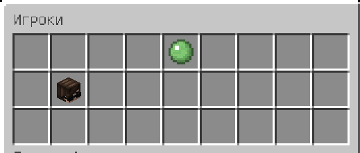
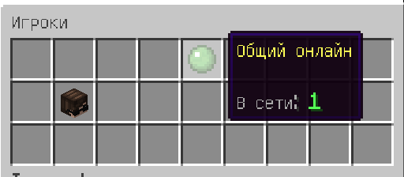
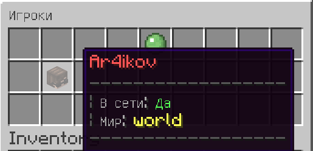

# OnlineGUI

Данный плагин позволит вам (и вашей семье) просматривать онлайн-игроков
сервера в режиме реального времени прямо в GUI, с подробной информацией
о месте прибывания и головой их скина

#### Плюсы:
- Кэширование скинов в одну HashMap'у (кал)
- Быстрое обновление инвентаря у каждого игрока
- Вывод подробных данных об игроках сервера

**Необходимо ядро `Spigot` версии `1.10R1`**

##### Получение игроков сервера
```java
    // Одиночный игрок из базы по нику
    OnlinePlayer player = OnlinePlayer.getPlayer("Ar4ikov");
    
    // Получение всех игроков из базы
    HashMap players = OnlinePlayer.getPlayers();
    
    // Получение текстуры игрока в BASE-64 формате
    String texture = OnlinePlayer.getTexture("Ar4ikov");
```






( ***Проект был создан в рамках обучения мной языка `Java` и самого ядра сервера `Spigot` + `NMS` (`Net.Minecraft.Server`) и не является чем либо ещё, кроме как теста и обучения!*** )
